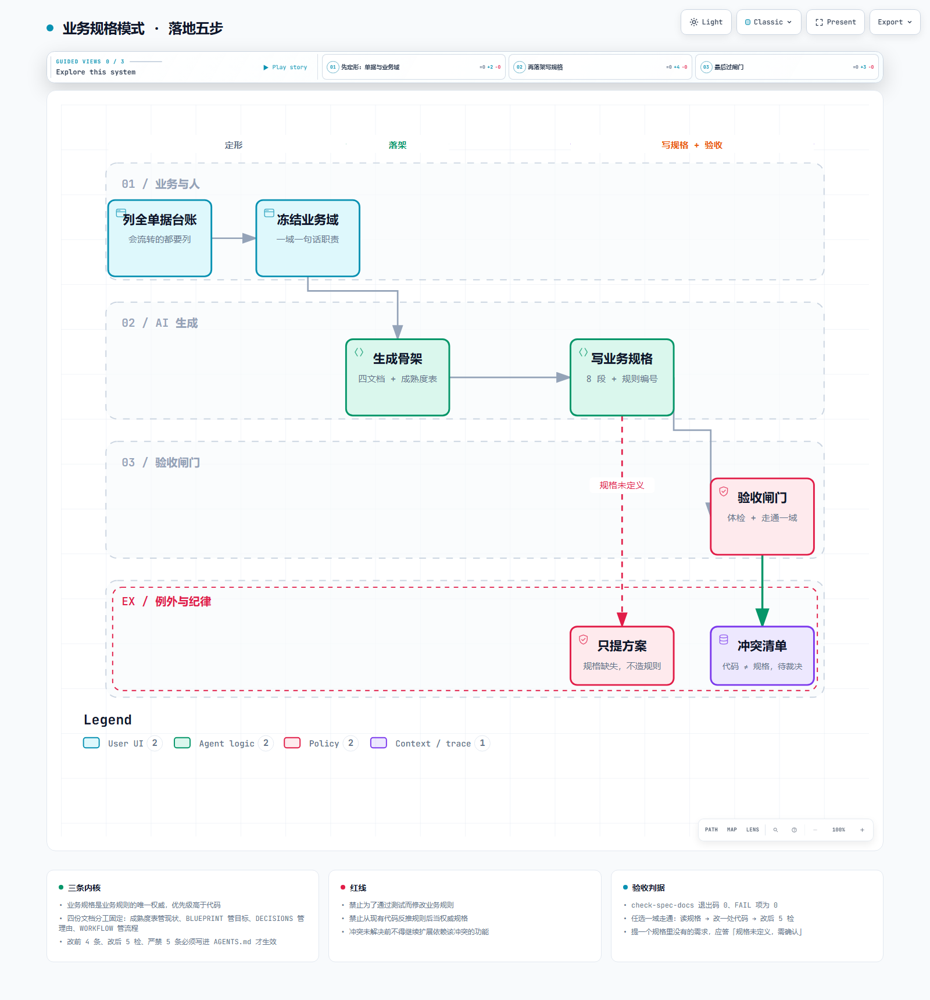

# dsh-env

DSH（DeepSeek Harness）环境与规范集 —— 把「AI 在这个项目里该怎么干活」固化成**可复用、可验收**的模块。

一个模块 = 一套成文的约定 + 能跑的检查手段。别人（或另一个 AI 会话）拿到这个仓库，不需要读你的聊天记录，也能照着落地。

> 语言：中文（约定本身面向中文项目）；脚本与命令保持通用。

---

## 模块清单

| 模块 | 解决什么 | 入口 | 状态 |
|---|---|---|---|
| [`modules/business-spec`](modules/business-spec/README.md) | **业务规格模式**：让业务规则有唯一权威来源，AI 改代码前必须先读规格，不许现编规则 | [模块 README](modules/business-spec/README.md) | v1 |
| （预留）| 后续的 DSH 环境/规范模块放 `modules/` 下即可 | — | — |



---

## 快速开始（以 business-spec 为例）

要求 **Node 23+**（脚本是 `.ts`，靠 Node 原生类型擦除直接执行，不需要编译、不需要 tsx）。

```powershell
# 1) 先预演，确认要生成什么（不写盘）
node modules/business-spec/工具/apply-template.ts `
  --target "D:\path\to\你的项目" `
  --domains "销售管理,采购管理,库存管理" `
  --with-sample --dry-run

# 2) 正式落骨架
node modules/business-spec/工具/apply-template.ts `
  --target "D:\path\to\你的项目" `
  --domains "销售管理,采购管理,库存管理" --with-sample

# 3) 体检：四份文档是否在场、每个业务域是否有域索引、成熟度表引用是否真实存在
node modules/business-spec/工具/check-spec-docs.ts --target "D:\path\to\你的项目"
```

`apply-template.ts` 只新增、不覆盖（除非显式 `--force`）；`check-spec-docs.ts` 退出码 `0` = 结构自洽、`1` = 有必须补齐的 FAIL 项。

---

## 模块约定（新增模块照这个来）

1. **一个模块一个目录**，目录内自带 `README.md`（说清解决什么、怎么用、怎么验收）。
2. **自带验收方式**：能跑脚本就给命令，不能跑就给出明确的检查清单与判据。
3. **模块之间不互相依赖**：真要共享，先各自写一份，等第二处真的用到再下沉。
4. **改模块只改自己的目录**，不顺手重构别人的。
5. **写清来源与边界**：约定从哪来、适用什么场景、不解决什么。

---

## 目录结构

```
dsh-env/
├─ README.md                 ← 本文件：仓库总览 + 模块约定
├─ LICENSE                   ← MIT
├─ docs/                     ← 仓库级图与说明
├─ modules/                  ← 各个模块
│  └─ business-spec/         ← 业务规格模式（第一个模块，布局自洽、脚本可跑）
└─ .github/workflows/ci.yml  ← CI：每次推送都实跑两个脚本，防止模板悄悄坏掉
```

---

## 参考

- 可视化图：[`docs/business-spec-overview.png`](docs/business-spec-overview.png)（静态）／[`modules/business-spec/docs/文档体系总览.html`](modules/business-spec/docs/文档体系总览.html)（可交互，支持深浅色、导览）
- 落地清单：[`modules/business-spec/迁移清单.md`](modules/business-spec/迁移清单.md)

## 许可

[MIT](LICENSE)
